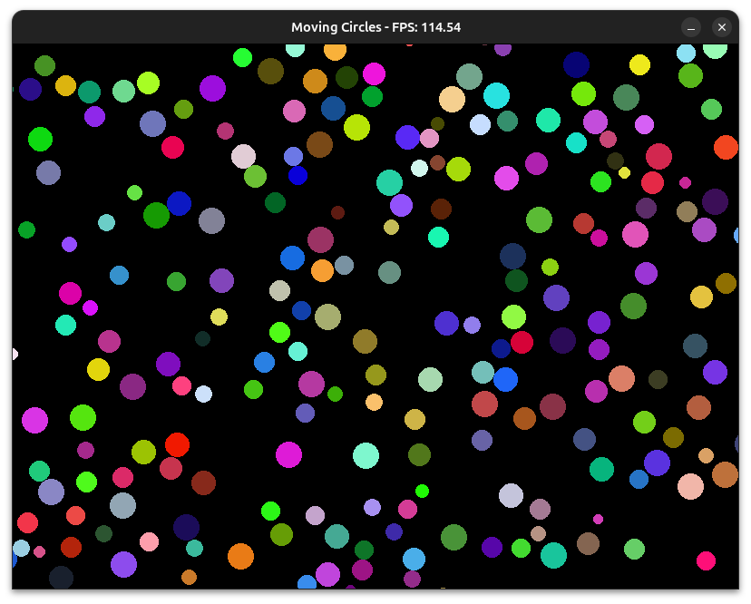

# sfb

This is kind of an expiramental project and possibly a bad idea. So, I wouldn't
necessarily recommend using it.

## high level goal
build a software renderer that can be used reasonably easily on machines with low or no gpu


### justifications

- to get some experience writing a wrapper around C for go libraries
- to explore the possibilities of making a software renderer (for machines with
  no gpu)
- to get some concurrency reps in

### how does it work?

1. The C layer calls SDL2 to load a window.
1. We create a texture.
1. we fill a buffer with pixels and then load it to that texture
1. a small api is exposed through a shared object file
1. there's a go wrapper library that hooks into that .so file and allows us to set
   individual pixels in the buffer
1. to draw shapes, we use some well known drawing algorithms that I tried to
   concurrency-ify

obviously, there are some limitations here. Like the larger your window is the
slower it will run and the cost of rendering a shape is bound to the size of the
shape. However, I was able to get these circles moving around at over 100fps
(granted that's on a computer that has a pretty fast cpu)

</img>

I'd like to play around with rewriting the drawing functions in C to
explore simd operations. That's unexplored terrority for me, but maybe I'll jump
down that rabbit hole someday.

### how to run

You need sdl on your system:

```bash
apt install libsdl2-dev
```

```bash
make # make the .so file
go run ./examples/big_circle/ # run one of the examples
```
